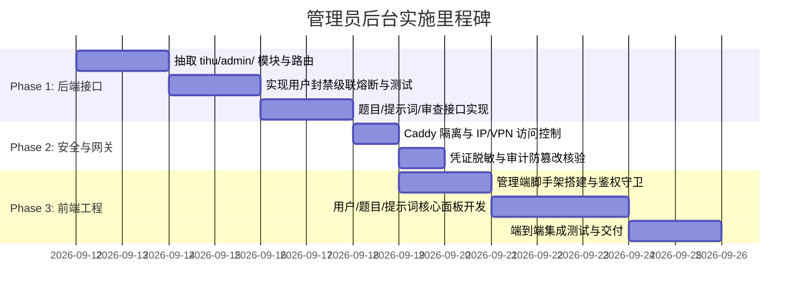

# TiHu 管理员后台系统设计方案 (Admin Backend Specification)

## 1. 背景与设计目标

TiHu 是一个面向社区的 BYOK（Bring Your Own Key）模型测评与 Coding Agent 试验平台。随着平台题目、公开作品及注册用户规模增长，需要一个完备、独立且安全的管理员后台系统，以支撑以下核心诉求：

1. **现存题目与版本治理**：全面管理题目（Challenges）及多版本（Versions），支持全站检索、合规下架/归档、官方题目录入与历史 Prompt/Rubric 版本审查对比。
2. **提示词全站管控**：对全站用户的提示词模板（Prompt Templates）提供检索、敏感内容核查、违规清理能力，并预留官方/系统预设提示词沉淀机制。
3. **用户账号生命周期与封禁熔断**：提供用户画像洞察，并实现高可靠、事务级、全链路级联熔断的账号封禁（Session 立即失效、排队任务取消、公开作品撤回、刷票记录作废）。
4. **审核工单与队列监控**：快速流转社区举报（Reports），监控 Worker 异步执行队列积压度与沙箱状态。
5. **绝对安全隔离**：严守 TiHu 现有的安全边界，确保管理后台不仅自身安全，而且**绝对不能成为泄露用户凭证（AES-256-GCM 密文密钥）的攻击面**。

---

## 2. 总体架构设计与部署拓扑

### 2.1 架构模式选型

方案选型权衡：
- **物理微服务方案**：独立运行一个独立的 Python Admin API 服务，需要重复配置 PostgreSQL 连接池与数据模型，存在模型定义不一致风险，且增加了常驻进程运维成本。
- **单体逻辑隔离方案（推荐采纳）**：在现有 FastAPI 应用内开辟独立的 `/api/admin/...` 命名空间和依赖注入链，前端独立构建单独的管理端 SPA（如 `web-admin/`），在反向代理（Caddy）层做路径与访问控制限制。

```text
                                  +-------------------------------------------------+
                                  |                 Caddy Gateway                   |
                                  +-----------------------+-------------------------+
                                                          |
                      +-----------------------------------+-----------------------------------+
                      | (Public Domain: tihu.example.com) | (Internal / Admin: admin.tihu.internal)
                      v                                   v
             +-----------------+                 +-----------------+
             | User Web Client |                 | Admin Dashboard |
             +--------+--------+                 +--------+--------+
                      |                                   |
         /api/v1/...  |                                   | /api/admin/...
                      +-----------------+-----------------+
                                        v
                            +-----------------------+
                            |     FastAPI App       |
                            | (Shared Engine/Core)  |
                            +-----------+-----------+
                                        |
               +------------------------+------------------------+
               v                                                 v
      +------------------+                              +------------------+
      | PostgreSQL Core  |                              | Dedicated Worker |
      | (db.py / models) |                              | (Docker / gVisor)|
      +------------------+                              +------------------+
```

### 2.2 网络边界与反向代理策略 (Caddy)

管理端 API 不应直接向公网非授权暴露：
1. **网络白名单**：在 Caddyfile 中对 `/api/admin/*` 及管理员静态前端资源配置源 IP 白名单（CIDR）或强制经过内网 VPN / Tailscale 接入。
2. **独立虚拟主机（可选）**：通过独立域名（如 `admin.tihu.internal` 或 `admin-preview.tihu.net`）承载管理前端与接口，与普通用户域名解耦，避免 Cookie 作用域扩散。
3. **严格的 CORS 与 Referrer-Policy**：禁止外部跨域访问 Admin 端点，启用 `SameSite=Strict` Cookie 机制。

---

## 3. 核心业务模块与数据流转

### 3.1 用户账号管理与封禁熔断 (User Management & Suspension)

用户管理是后台的核心控制面。TiHu 平台涉及排队运行、模型计费与社区打榜，封禁操作必须具备**强一致性级联熔断**。

#### 3.1.1 封禁级联熔断事务 (Cascade Suspension Flow)

当管理员执行 `suspend_user` 时，系统在同一个数据库写事务（`BEGIN IMMEDIATE` / 排他行锁）中依序执行：

```text
[Admin Trigger]
       │
       ▼
[Begin DB Transaction]
       ├── 1. UPDATE users SET suspended = TRUE WHERE id = :user_id
       ├── 2. DELETE FROM sessions WHERE owner_id = :user_id (踢出所有设备)
       ├── 3. DELETE FROM votes WHERE user_id = :user_id (清除所有投票，维护天梯公平)
       ├── 4. UPDATE runs SET published = FALSE, hidden = TRUE WHERE owner_id = :user_id (公开作品立即隐身)
       ├── 5. UPDATE runs SET status = 'canceled', finished = now(), error = 'account_suspended'
       │      WHERE owner_id = :user_id AND status IN ('queued', 'running') RETURNING id
       │      (熔断队列中或执行中的任务，释放 runner 资源)
       ├── 6. 批量记录 events 事件: "Canceled because the account was suspended."
       └── 7. 写入 audit 审计日志 (actor=admin_id, action='user.suspend', target=user_id)
       │
       ▼
[Commit Transaction]
```

#### 3.1.2 解封操作 (Reinstate Flow)
1. `UPDATE users SET suspended = FALSE WHERE id = :user_id`。
2. 历史作品保持当前的 `hidden=TRUE` 状态，不自动重新上线，由管理员或用户人工发起作品解封复核。
3. 写入 audit 审计日志。

#### 3.1.3 用户列表检索与能力画像
- 支持按：用户名/邮箱模糊检索、注册时间范围、`role`（user/admin）、`verified`、`suspended` 状态多维过滤。
- 详情聚合展示：已绑定 Credentials 概览（脱敏）、历史 Runs 总数与失败率、被举报记录（Reports）。

---

### 3.2 现存题目与多版本管理 (Challenges & Versions)

TiHu 的评测核心是 Challenge 及其多版本（Versions，包含 prompt 和 rubric）。

#### 3.2.1 题目生命周期管控
- **题目状态管理**：
  - `archived = false`：正常状态，用户可选取并发起测试。
  - `archived = true`：已归档/下架。已被归档的题目禁止用户提交新的 Run（`challenge_archived`），但已生成的历史评测作品在画廊中按原有权限保留。
- **题目编辑与版本审查**：
  - 列表展示当前版本号（`current_version`）、创建者、分类、衍生 Runs 数量。
  - 版本溯源：支持按版本号降序查看每一次版本发布的 `prompt`、`rubric`、`sha256` 校验和及发布时间。
  - 版本对比（Diff）：提供管理员对比不同版本之间 Prompt 引导语和 Rubric 评判规则的差异视图。
- **官方题目管理**：
  - 管理员拥有全站题目的版本发布权限（不受 owner 限制）。
  - 支持后台直接发布官方标准题库。

---

### 3.3 提示词管理 (Prompt Templates)

当前系统中的 `prompt_templates` 属于用户私有资产（`owner_id`），但平台需要对注入风险与不良内容进行合规管控。

#### 3.3.1 全站提示词检索与审查
- 全局查询列表：展示模板名称、创建者（关联查询 `users.username`）、内容摘要、创建时间。
- 敏感关键词搜索：支持全文检索（SQL `LIKE` 或全文索引），排查 Prompt 越狱注入代码（Jailbreak / System Override）。
- 违规处理：管理员可执行强制删除（`DELETE FROM prompt_templates WHERE id = :id`），并向审计日志记录删除操作。

#### 3.3.2 官方系统预置提示词库（模型扩展设计）
- **数据结构兼容建议**：
  - 约定 `owner_id` 为内置管理员账号（或预设虚拟账号），或在 `prompt_templates` 表上扩展 `is_official: Boolean`（默认为 False）。
  - 管理员可在后台维护一组高质量系统提示词（如：“Clean Architecture 编程规范”、“极端边界测试生成器”），前端对所有普通用户提供一键“克隆/使用”能力。

---

### 3.4 审查工单、运行监控与审计 (Moderation, Metrics & Audit)

#### 3.4.1 举报工单流 (Reports)
- 关联查询：举报人、被举报作品（`runs`）、被举报作品作者、举报理由（`reason`）、创建时间。
- 审查联动操作：
  - **隐藏违规作品**：将目标 Run 标记为 `hidden = true, published = false`。
  - **标记举报完成**：`UPDATE reports SET resolved = true`。
  - **连带处罚**：若情节恶劣，直接由该界面触发作者账号的封禁熔断。

#### 3.4.2 队列与系统健康度监控 (Metrics)
- 实时统计各状态的 Runs 分布：`queued`、`running`、`succeeded`、`failed`、`canceled`。
- 长期处于 `running` 且 `heartbeat` 超时的卡死任务预警，支持手动触发中止清理。

#### 3.4.3 不可篡改审计日志 (Audit Trail)
依托 `db.audit` 表，管理员执行的每一项关键变更均需持久化审计记账：
- 结构字段：`actor`（管理员 User ID）、`action`（具体动作枚举）、`target`（操作对象 ID）、`created`（高精度时间戳）。
- 动作规范命名：
  - `moderation.suspend_user` / `moderation.reinstate_user`
  - `moderation.archive_challenge` / `moderation.restore_challenge`
  - `moderation.delete_prompt`
  - `moderation.hide_run` / `moderation.unhide_run`
  - `moderation.resolve_report`
  - `admin.promote_user` / `admin.demote_user`

---

## 4. API 详细规范 (RESTful Admin Endpoints)

所有接口统一在 `/api/admin` 前缀下，必须经过 `who = Depends(admin)` 鉴权（`who['role'] == 'admin'` 且 `not who['suspended']`）。

### 4.1 用户管理接口

| 方法 | 路径 | 描述 | 请求参数 / Body | 响应 |
| :--- | :--- | :--- | :--- | :--- |
| `GET` | `/api/admin/users` | 用户分页与筛选列表 | `q`, `role`, `suspended`, `cursor`, `limit` | `{ items: UserSummary[], next_cursor, total }` |
| `GET` | `/api/admin/users/{id}` | 用户深度详情 | 路径参数 `{id}` | 用户基础信息、凭证统计（脱敏）、近期 Runs |
| `POST`| `/api/admin/users/{id}/suspend` | 封禁用户（级联熔断） | `{ reason: string }` | `{ ok: true, canceled_runs_count: int }` |
| `POST`| `/api/admin/users/{id}/reinstate` | 解封用户 | `{ reason: string }` | `{ ok: true }` |
| `POST`| `/api/admin/users/{id}/role` | 调整用户角色 | `{ role: "admin" \| "user" }` | `{ ok: true }` |

> **关键安全性防护**：读取用户详情中的 API 凭证时，绝对禁止输出 `credentials.sealed`，仅输出 `id, label, last4, base_url, protocol, created`。

### 4.2 题目与版本接口

| 方法 | 路径 | 描述 | 请求参数 / Body | 响应 |
| :--- | :--- | :--- | :--- | :--- |
| `GET` | `/api/admin/challenges` | 题目分页列表（包含已归档）| `q`, `category`, `archived`, `cursor`, `limit` | `{ items: ChallengeAdminItem[], next_cursor, total }` |
| `GET` | `/api/admin/challenges/{id}` | 题目及所有版本历史详情 | 路径参数 `{id}` | 题目完整信息 + 全部 `versions` 列表 |
| `POST`| `/api/admin/challenges/{id}/archive` | 下架/归档题目 | `{}` | `{ ok: true }` |
| `POST`| `/api/admin/challenges/{id}/restore` | 恢复/取消归档 | `{}` | `{ ok: true }` |
| `POST`| `/api/admin/challenges/{id}/versions` | 发布新版本（官方修改） | `{ prompt: string, rubric: string }` | `{ id: string, number: int }` |

### 4.3 提示词管理接口

| 方法 | 路径 | 描述 | 请求参数 / Body | 响应 |
| :--- | :--- | :--- | :--- | :--- |
| `GET` | `/api/admin/prompts` | 全站提示词分页检索 | `q`, `owner_id`, `cursor`, `limit` | `{ items: PromptAdminItem[], next_cursor, total }` |
| `GET` | `/api/admin/prompts/{id}` | 提示词模板详情与完整内容 | 路径参数 `{id}` | 模板详情与完整 `body` 内容 |
| `DELETE`| `/api/admin/prompts/{id}` | 强制删除违规提示词 | `{ reason: string }` | `{ ok: true }` |

### 4.4 审查与系统运维接口

| 方法 | 路径 | 描述 | 请求参数 / Body | 响应 |
| :--- | :--- | :--- | :--- | :--- |
| `GET` | `/api/admin/reports` | 待处理举报列表 | `resolved: bool` | `ReportItem[]` |
| `POST`| `/api/admin/reports/{id}/resolve`| 标记处理完成 | `{}` | `{ ok: true }` |
| `POST`| `/api/admin/runs/{id}/visibility`| 强制隐藏/取消隐藏 Run | `{ hidden: bool }` | `{ ok: true }` |
| `GET` | `/api/admin/metrics` | 队列状态与系统概览 | - | `{ queue: [...], total_users: int, ... }` |
| `GET` | `/api/admin/audit` | 审计日志列表 | `cursor`, `limit`, `actor`, `action` | `{ items: AuditItem[], next_cursor }` |

---

## 5. 安全设计与防御规范

### 5.1 凭证绝对脱敏（Zero-Exposure of Provider Secrets）
TiHu 使用 AES-256-GCM 加密存储了用户的各类大模型 API Key。
- **基线原则**：管理员后台没有任何正当业务理由需要读取或查看用户的明文 Key。
- **代码实现硬约束**：
  所有 Admin 相关 SQL 查询和 Pydantic 响应模型中，**严禁引入 `db.credentials.c.sealed`**。即使是全局搜索或导出功能，也只能暴露 `last4` 尾号与 `label`。

### 5.2 权限提升与越权防护 (Anti-Privilege Escalation)
- 管理员修改自身角色：禁止管理员通过 API 将自己的角色从 `admin` 降权为 `user`，防止发生系统中无可用管理员的死锁状态。
- 操作权限熔断：若当前管理员账号在操作期间被其他管理员标记为 `suspended`，其所有请求在验证依赖 `Depends(admin)` 时立即返回 403，会话即刻失效。

### 5.3 跨站请求伪造 (CSRF) 与重放防御
- 所有涉及状态变更的 POST/DELETE 操作必须校验自定义 HTTP 头（如 `X-Requested-With: TiHuAdmin` 或专用 CSRF Token）。
- Cookie 必须配置 `HttpOnly`, `SameSite=Strict`, `Secure`（生产环境）。

---

## 6. 前端管理面板 (Admin Dashboard) 规范

前端推荐新建独立的 SPA 目录（例如 `web-admin/`），采用现代化轻量组件库（如 Vite + React/Vue + Arco Design / Ant Design / shadcn-ui），聚焦于高效表格与数据操作。

### 6.1 页面结构规划
```text
├── 仪表盘 (Dashboard)
│   ├── 队列状态卡片 (Queued / Running / Finished)
│   ├── 待处理举报工单告警
│   └── 近期异常任务一览
├── 用户中心 (User Directory)
│   ├── 用户列表（多条件过滤、快捷封禁/解封按钮）
│   └── 用户画像面板（历史 Run、关联举报）
├── 题目中心 (Challenge Management)
│   ├── 题目列表（归档开关、衍生 Runs 统计）
│   ├── 版本演变面板（Prompt & Rubric 历代查看、Diff 差异比对）
│   └── 发布新题目 / 发布新版本表单
├── 提示词中心 (Prompt Templates)
│   ├── 全站提示词检索面板
│   └── 违规提示词清理与删除
├── 内容审查 (Moderation)
│   ├── 社区举报流转处理中心
│   └── 作品（Runs）一键隐藏/恢复
└── 安全审计 (Audit Trail)
    └── 溯源日志（按管理员、操作类型、目标对象过滤）
```

### 6.2 交互防误触设计
- **高危操作二次确认（Double Confirmation）**：
  封禁用户、下架挑战、删除提示词等操作，弹出确认对话框，强制管理员输入操作理由（`reason`），该理由同步记录至 `audit` 审计表，形成责任闭环。
- **状态高亮反馈**：
  已封禁用户（红色标签）、已归档题目（灰度标识）、未处理举报（黄色预警），界面关键状态视觉层级分明。

---

## 7. 实施路线图 (Implementation Roadmap)



- **第一阶段（后端核心与熔断）**：
  在 `tihu/` 目录下新增 `admin_api.py`，完善用户分页、封禁级联事务、题目版本维护及提示词审查接口，配套编写对应的 Pytest 测试套件覆盖率。
- **第二阶段（网关策略与安全硬化）**：
  调整 `Caddyfile`，配置访问控制策略，并对全量 Admin 接口做安全审计，验证密钥脱敏与 CSRF 拦截。
- **第三阶段（前端界面与全链路联调）**：
  完成管理端 UI 构建与打包，接入反向代理，实现全链路功能验收。
